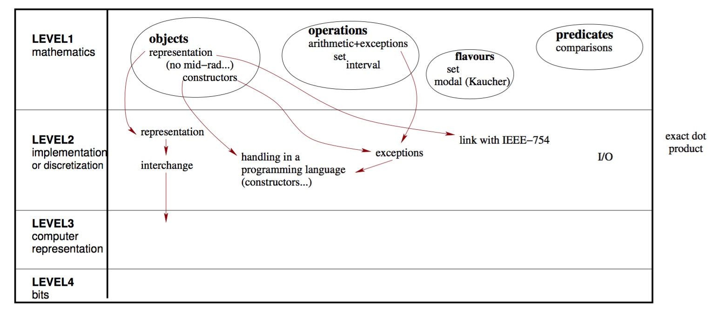

<!--
$size: 4:3
$theme: default
page_number: true
*page_number: false
-->

Introduction to the IEEE 1788-2015 Standard for Interval Arithmetic
===

Nathalie Revol

NSV 2017, workshop of CAV 2017, Jul 2017, Heidelberg, Germany.
Springer, pp.14-21, 2017, LNCS.

@tyabu12

---

# 1. Introduction

区間演算は、それ自体が正当性を証明している数値演算

全演算は, 入力から考えられる真値を包囲していると仮定した区間を入力として受け取り, 対応する出力は真値を包囲していることを保証

しかし区間演算を実装したライブラリは, いろいろな区間演算に基づく
ex. filib++ は集合ベース風味, MPFI は浮動小数点数の IEEE 754-2008 に寄せてある
→ 共通のベンチマークやテストを用意することはできない
→ IEEE 1788-2015 として標準化

---

# 2. 全体像: レベルごとの構造

---

## レベル1: 数学上のレベル

実数における区間とその演算

## レベル2: レベル1の離散化

区間データ: レベル1の実体化, 区間型: 区間データの有限集合

コンピューター上で実装可能

このレベルでの議論は, 連続世界は離散と有限環境を用いて実装されているという事実に関連したものである

---

## レベル3: 区間データの表現

e.g. 数値型の終端で表す

浮動小数点数値の観点から, 一般的だが必要ではない

## レベル4: 表現方法のエンコード

浮動小数点演算の標準化におけるレベル4と同等

数値はこの標準化の目的ではないため, このレベルについてはほとんどない

---

# 3. Flavors

- 共通認識: $[1,2] + [3,5]$
- 元にする数学モデルによって違う: $[1, +∞), [4,6]/[0,1] or [2,1]$
集合論, Kaucher arithmetic, cset theory, modal arithmetic, ....

標準では, まず全てのモデルで共通しているものといないものに分離
→ 様々なモデルでも, 共通定義に一致する限り, 容易に適合 (標準では *flavors* と呼ばれる)

共通部分と様々な数学モデル *hooks* 部分に分かれている

---

# 3.1 共通な区間と演算

$\mathbb{IR}$: 空でない閉じた境界の実数区間の集合 [Clause 7.2]

$x,y \in \mathbb{IR}$ について, 以下の演算を定義

$-x$, $x+y$, $x-y$, $xy$, $x/y$ ($y$ が $0$ を含まない場合), $x^2$, $\sqrt{x}\ (x \ge 0)$, 累乗, 対数, $\mathbb{IR}$ 定義域の三角関数, など

他にも二区間の交差 (intersection) や凸包 (convex hull) なども共通演算

---

# 3.2 集合ベースの flavor とその他

集合ベースの flavor は, Clauses 10 to 14 で詳述

例として共通区間に, $[1,+∞)$ は許可しするが $[2, 1]$ はしないという flavor を考える.

$x_1,...,x_n$ は区間とすると,

$f(x_1,...,x_n)$
$=$ Hull $\bigl\{ f(x_1,...,x_n) : x \in x_i$ for $1 \le i \le n$ が定義されている $\bigl\}$

このとき, Hull は与えられた集合の凸包を定義
つまり, $\sqrt{[-1,4]}=[0,2]$, $\sqrt{[-2,-1]}=\emptyset$

---

他の flavors も IEEE 1788-2015 に追加することができる

実数区間の離散化を扱う Kaucher arithmetic, modal arithmetic や Rump’s proposal などの flavor は議論中である.

---

# 4. Decorations

簡潔に言うと, 浮動小数点数における NaN になるケースの扱い

例. $f : x \mapsto \sqrt{x} - 1$ について, $x = [-1, 4]$ とすると

$f(x) = f(\sqrt{[-1, 4]})= \sqrt{[-1, 4]} - 1 = [0, 2] - 1 = [-1, 1]$

IEEE 1788-2015 では, このような値域外などの情報 (*decoration* と呼ぶ) は演算結果に付与する

この手法をめぐっては, だいぶ議論があったらしい

---

# 5. レベル2: 離散化問題

省略.

---

# 6. 正確なドット積

省略.

---

# 7. IEEE 1788-2015 を実装しているライブラリ

## libieee1788

- Marco Nehmeier により開発された C++ のライブラリ
- IEEE 1788-2015 の全ての要求に可能な限り対応
  例: 区間境界にはどんな型でも使用できる

## Octave Interval

- Oliver Heimlich により開発された Gnu Octave のライブラリ
- アルゴリズムのテストなどが簡単にできる
- 開発の単純化のため, 境界値は 64 bit 浮動小数点数のみ対応